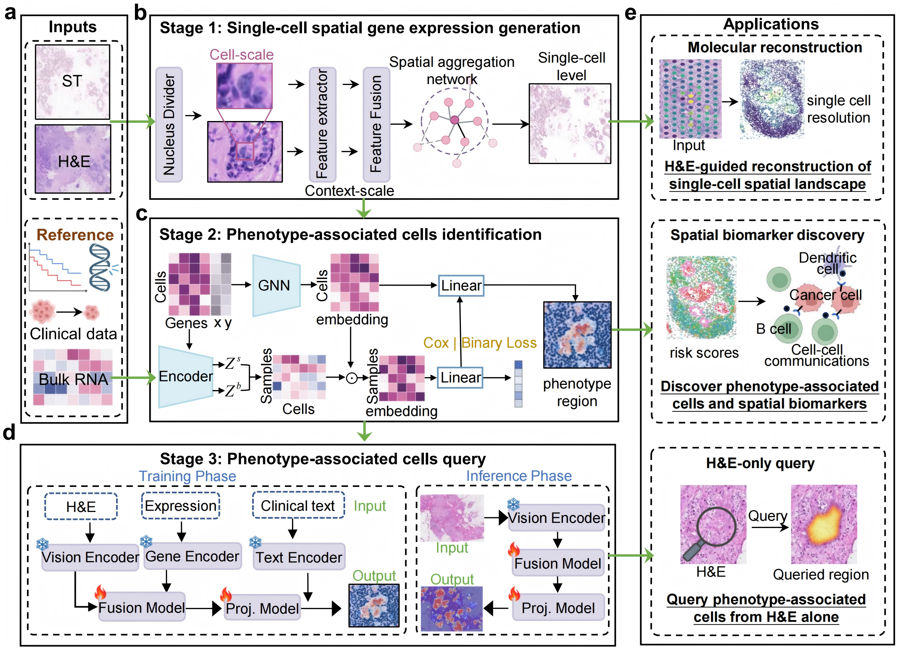

PhenoMap documentation
======================

PhenoMap maps phenotype-associated tissue states from H&E histology, spatial
transcriptomics, single-cell gene representations and bulk clinical cohorts.
The tutorials below are organized by function: each page describes one analysis
task, its inputs, the command entry points and the expected visual output.

Overview
--------

   PhenoMap workflow for single-cell spatial gene-expression generation,
   phenotype-associated region identification and phenotype-region query.

Tutorials
---------

.. list-table::
   :header-rows: 1
   :widths: 8 32 60

   * - No.
     - Function
     - Output
   * - 1
     - :doc:`Single-cell spatial gene expression generation <tutorials/01_single_cell_expression_generation/index>`
     - Cell-scale expression matrix and reconstructed gene maps.
   * - 2
     - :doc:`Spatial single-cell type annotation <tutorials/02_spatial_cell_type_annotation/index>`
     - Cell-type labels and spatial cell-type maps.
   * - 3
     - :doc:`Phenotype-associated region identification <tutorials/03_phenotype_region_identification/index>`
     - Cell-level phenotype scores and high-risk spatial regions.
   * - 4
     - :doc:`Clinical phenotype analysis <tutorials/04_clinical_phenotype_analysis/index>`
     - Survival, immune response and mutation-associated analyses.
   * - 5
     - :doc:`Intra-center phenotype region query <tutorials/05_intra_center_region_query/index>`
     - Query phenotype-associated regions within the same center or cohort.
   * - 6
     - :doc:`Cross-center phenotype region query <tutorials/06_cross_center_region_query/index>`
     - Transfer phenotype-region queries across centers or external cohorts.

Contents
--------

.. toctree::
   :maxdepth: 2

   installation
   architecture
   datasets
   tutorials/index
