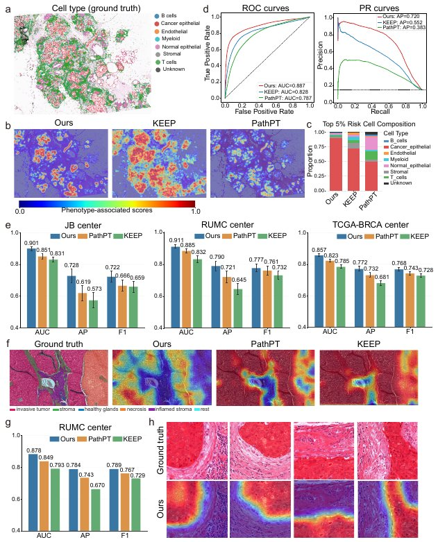

Intra-center phenotype region query
===================================

This function queries phenotype-associated regions within the same center,
cohort or staining/domain setting. It is used when the source phenotype model
and target query slides come from a matched or closely related center.

   Example H&E phenotype-region query and comparison against KEEP and PathPT.

Input
-----

* Source PhenoMap checkpoint.
* Target H&E image or ROI image folder.
* Optional target annotation mask for evaluation.
* Inference config with patch size, stride and output directory.

Run
---

.. code-block:: bash

   python step3/train.py \
     --mode inference \
     --config step3/configs/template.yaml \
     --ckpt_path /path/to/last.ckpt

Main outputs
------------

* Patch-level risk scores.
* Dense phenotype score maps.
* Region overlays for visual inspection.
* Cell-type or ROI agreement metrics when annotations are available.

Relevant files
--------------

* ``step3/train.py``
* ``step3/configs/template.yaml``
* ``step3/data/dataset.py``
